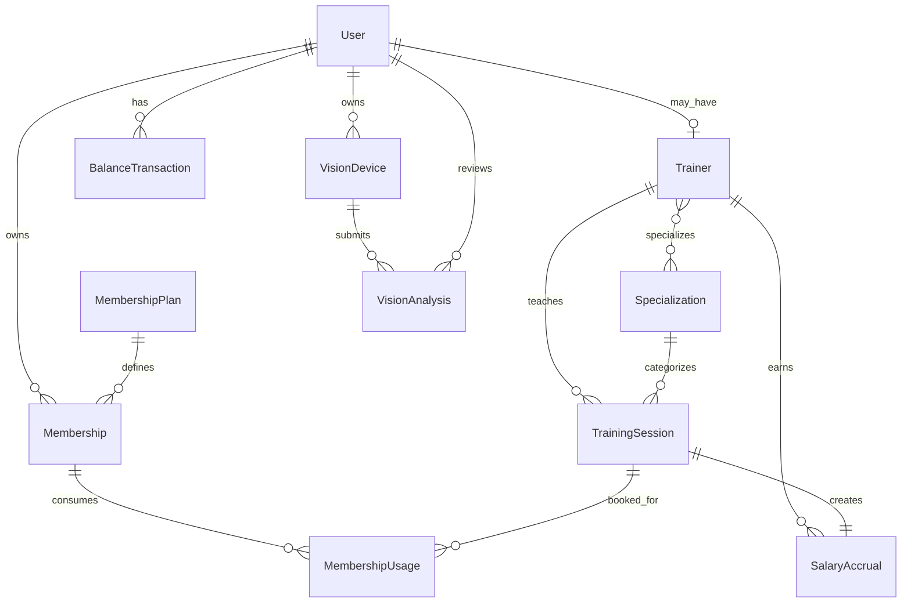
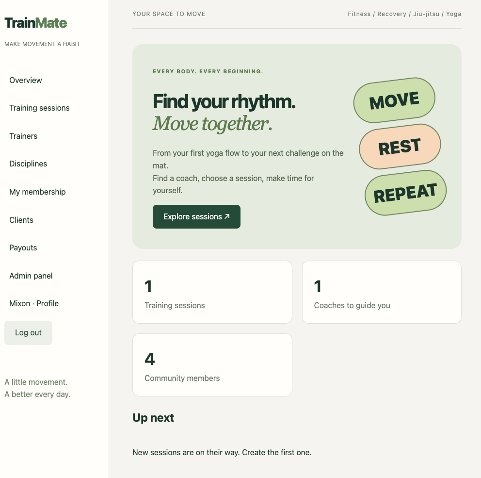

# TrainMate

TrainMate is a Django web application for managing a fitness community with
fitness, rehabilitation, jiu-jitsu and yoga sessions. It gives clients a clear
way to book training, trainers a workspace for their sessions and earnings, and
administrators the tools to run the catalogue, memberships and payouts.

## Key features

- Browse, search and paginate training sessions and trainer profiles.
- Register an account, confirm its email address, reset a password and edit a
  personal profile.
- Book and cancel a place using an active membership; capacity and duplicate
  bookings are validated on the server.
- Choose a membership plan, add demo balance funds and track remaining visits.
- Calculate trainer earnings per participant and follow their payout status.
- Manage users, trainers, disciplines, membership plans, sessions and payout
  records through the site and Django Admin.

## Roles and access

- **Client** — can browse and search sessions, choose a membership plan, book
  a place, cancel their own eligible booking and edit their own profile.
- **Trainer** — has a linked Trainer profile and can create, edit and delete
  only their own scheduled training sessions. Trainers can also view their own
  earnings.
- **Administrator** — a Django superuser with access to the **Admin panel** in
  TrainMate. The administrator manages clients, trainer profiles, disciplines,
  membership plans, balances, every training session and payout records.

Create the initial administrator locally with:

```bash
python manage.py createsuperuser
```

## Memberships and trainer payouts

- Clients use **My membership** to view their PLN balance, add demo funds and
  purchase an active membership plan themselves.
- An administrator configures plan price, visit count and validity period.
  Purchasing a plan activates a membership automatically.
- Booking consumes one membership visit; cancellation returns it when the
  session has not been confirmed.
- Each trainer has an editable PLN rate per participant (default: **10.00
  PLN**). A booking creates an **Accrued** salary record. Once an administrator
  completes the session, the record becomes **Ready for payout**; after payment
  it can be marked **Paid**.
- Trainers see their accrued, confirmed and paid totals on **My earnings**.
  Administrators can manually adjust salary amounts and payment status on
  **Payouts** or in Django Admin.

> **Demo payment notice:** balances and membership purchases are simulated for
> learning purposes. TrainMate does not process real card or bank payments.

## Vision Lab — Raspberry Pi 5 prototype

TrainMate includes a privacy-first integration point for a Raspberry Pi 5 with
Camera Module 3 Wide. The Pi agent performs pose detection on-device and sends
an annotated, short-lived live preview to the device owner's **Vision Lab**.
The preview expires from server memory after seconds; it is not a video
recording. With the owner's consent, one annotated progress frame, a
pose-visibility score and feedback are saved each minute so the client can
follow their trend over time.

The Pi agent lives in [raspberry_pi](raspberry_pi/). Register a device from the
Django host to generate its one-time bearer token:

```bash
python manage.py create_vision_device --name mixon-pi --owner Mixon
```

See [raspberry_pi/README.md](raspberry_pi/README.md) for installation and local
network setup. Use HTTPS, a private network or VPN, and rotate device tokens
before any production deployment.

## Security

- New accounts are inactive until the user confirms the activation link sent by
  email.
- Password reset uses Django's time-limited reset token flow.
- Login and password-reset requests are rate limited to reduce brute-force
  attempts.
- Booking, cancellation and session completion use POST requests with CSRF
  protection.

For a multi-server production deployment, use a shared cache such as Redis for
rate-limit counters and configure a real SMTP provider.

## Local setup

**Requirements:** Python 3.12+.

```bash
git clone <your-repository-url>
cd trainmate
python3 -m venv venv
source venv/bin/activate
pip install -r requirements.txt
python manage.py migrate
python manage.py seed_demo
python manage.py createsuperuser
python manage.py runserver
```

Open [http://127.0.0.1:8000/](http://127.0.0.1:8000/) in your browser. During
local development, emails are printed to the terminal by Django's console email
backend, so activation and reset links can be copied from there.

## Configuration and production notes

Copy [.env.example](.env.example) to your hosting environment and set a private
`SECRET_KEY`, `DEBUG=0`, allowed hosts and SMTP credentials. The application
enables secure cookies and HTTPS settings when debug mode is disabled.

Run checks before deployment:

```bash
python manage.py test
python manage.py check
DEBUG=0 SECRET_KEY="a-long-unique-secret" ALLOWED_HOSTS="example.com" python manage.py check --deploy
```

## Database diagram

The editable [draw.io database diagram](docs/database-diagram.drawio) covers
users, trainer profiles, sessions, memberships, balance transactions, salary
accruals and Raspberry Pi vision results. Open it with
[diagrams.net](https://app.diagrams.net/) to edit it.



## Screenshots

### Home page



Screenshots of the session list, memberships, trainer earnings, payout
dashboard and Django Admin will be added here before final submission.

## Project scope

TrainMate is an educational portfolio project. The Raspberry Pi Vision Lab is
an on-device pose-analysis prototype. Real payment-provider integration, CI/CD,
Docker deployment, centralised logging and automated database backups are
intentionally outside the current scope.
