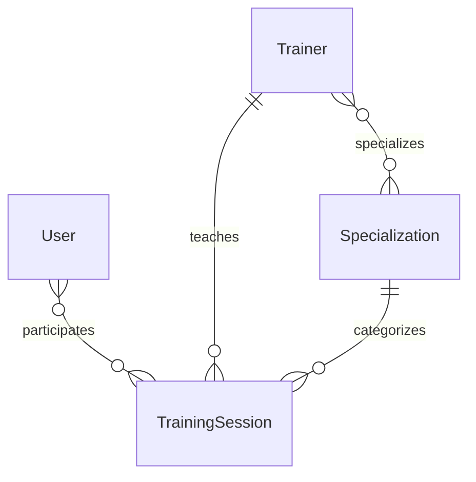

# TrainMate

A Django community workspace for fitness, rehabilitation, jiu-jitsu and yoga.
The first version includes session booking, trainers, disciplines, account
registration, profile editing, search, pagination and an admin interface.

## Roles and access

- **Client** — can browse and search sessions, book a place, cancel their own
  booking and edit their own profile.
- **Trainer** — has a linked Trainer profile and can create, edit and delete
  only their own training sessions.
- **Admin** — Mixon is the only administrator. The admin has access to the
  **Admin panel** directly from the TrainMate website and can manage clients,
  trainer profiles, disciplines and every training session. The account must be
  created as a Django superuser: `python manage.py createsuperuser --username Mixon`.

## Local setup (Python 3.12+)

```bash
python3 -m venv venv
source venv/bin/activate
pip install -r requirements.txt
python manage.py migrate
python manage.py seed_demo
python manage.py createsuperuser
python manage.py runserver
```

Open http://127.0.0.1:8000/ and sign up or log in.

```bash
python manage.py test
python manage.py check
```

## Database diagram



User inherits AbstractUser. Sessions have a future start time, positive
duration/capacity and a coach qualified in the selected discipline.
Booking and cancellation use POST with CSRF protection. Capacity and duplicate
bookings are checked on the server.

This is a shared educational workspace: authenticated members can manage the
catalog. Production role-based permissions are a future step.

AI camera analysis is a future phase and is not implemented in this version.
Screenshots of the final interface should accompany the portfolio pull request.

For deployment set a private SECRET_KEY, DEBUG=0, configure allowed hosts,
static file serving and a production server.
