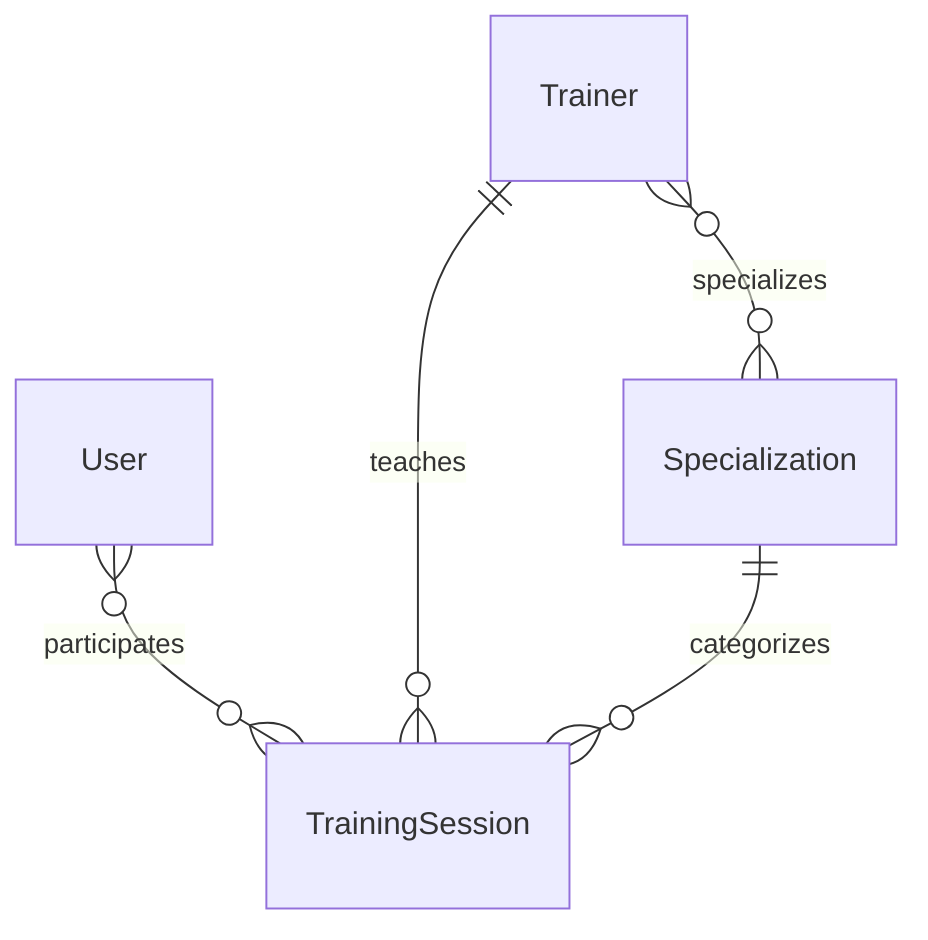

# TrainMate

A Django community workspace for fitness, rehabilitation, jiu-jitsu and yoga.
The first version includes session booking, trainers, disciplines, account
registration, profile editing, search, pagination and an admin interface.

## Roles and access

- **Mixon** is the only site administrator and must be created as a Django
  superuser: `python manage.py createsuperuser --username Mixon`.
- **Clients** can browse, search, book sessions, cancel their own bookings and
  edit their own profile.
- **Trainers** have a linked Trainer profile and can create, edit and delete
  only their own sessions.
- Only Mixon can manage trainer profiles and disciplines, or manage every
  training session. Create and link trainer profiles in `/admin/`.

## Local setup (Python 3.12+)

```bash
python3 -m venv venv
source venv/bin/activate
pip install -r requirements.txt
python manage.py migrate
python manage.py seed_demo
python manage.py createsuperuser
python manage.py runserver
```

Open http://127.0.0.1:8000/ and sign up or log in.

```bash
python manage.py test
python manage.py check
```

## Database diagram



User inherits AbstractUser. Sessions have a future start time, positive
duration/capacity and a coach qualified in the selected discipline.
Booking and cancellation use POST with CSRF protection. Capacity and duplicate
bookings are checked on the server.

This is a shared educational workspace: authenticated members can manage the
catalog. Production role-based permissions are a future step.

AI camera analysis is a future phase and is not implemented in this version.
Screenshots of the final interface should accompany the portfolio pull request.

For deployment set a private SECRET_KEY, DEBUG=0, configure allowed hosts,
static file serving and a production server.
