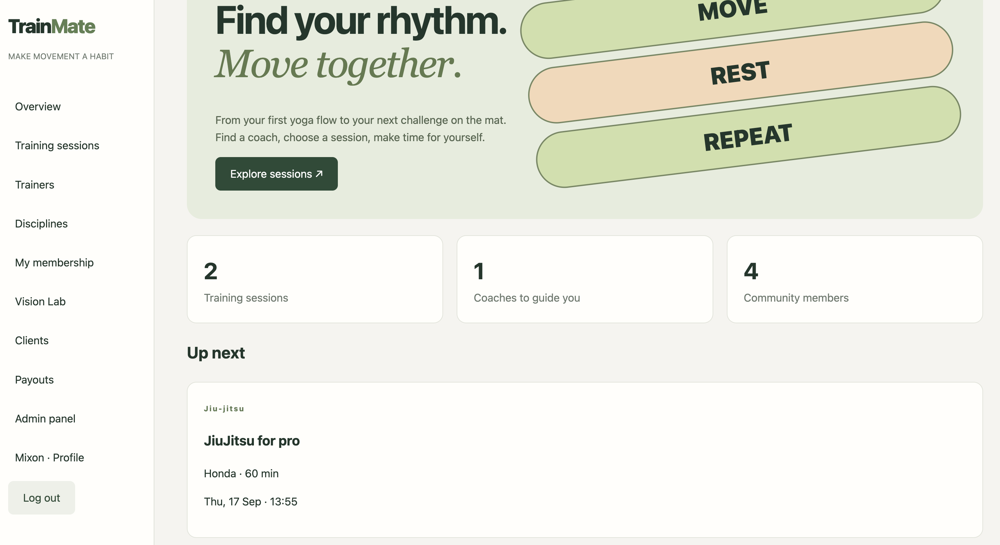
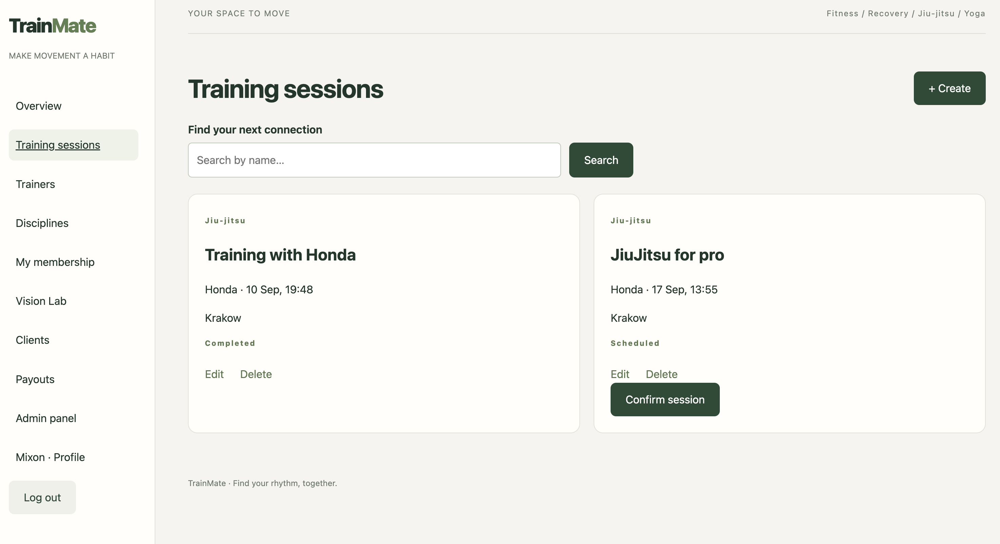
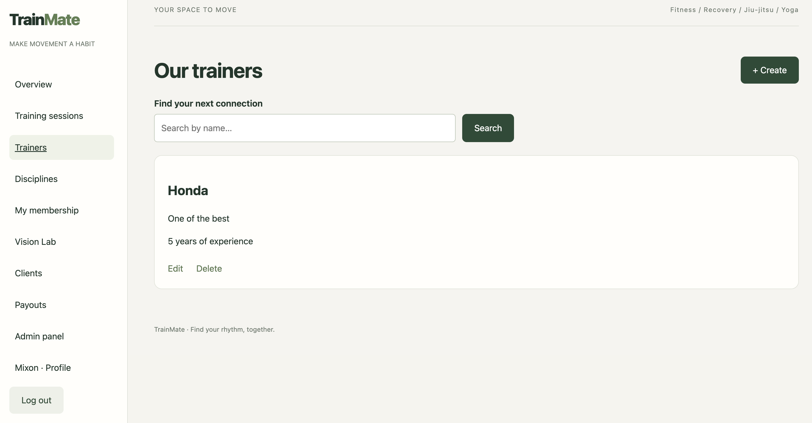
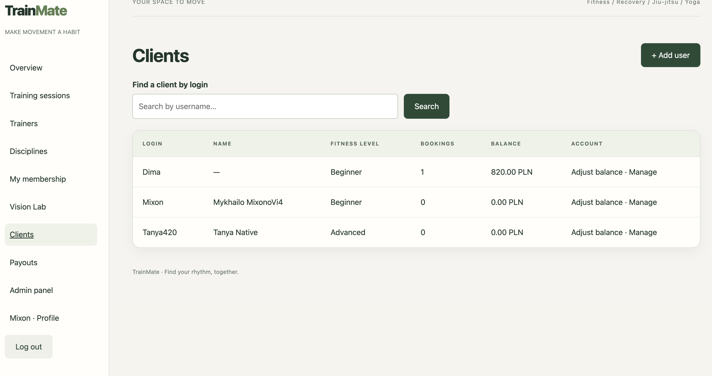
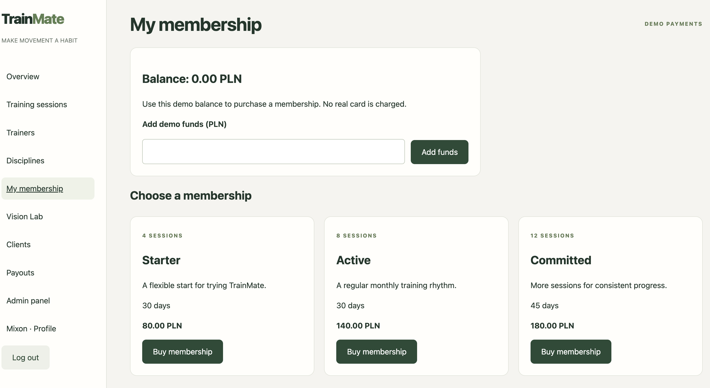
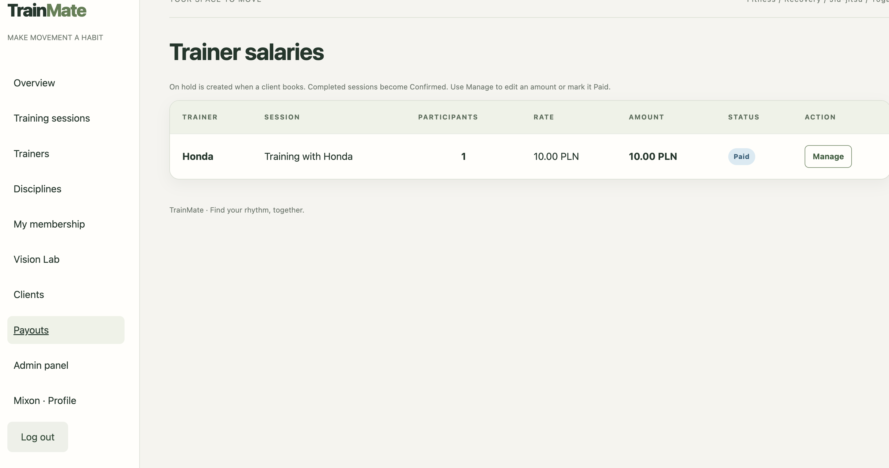
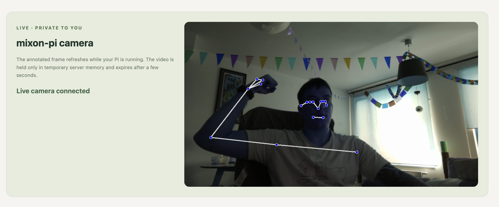
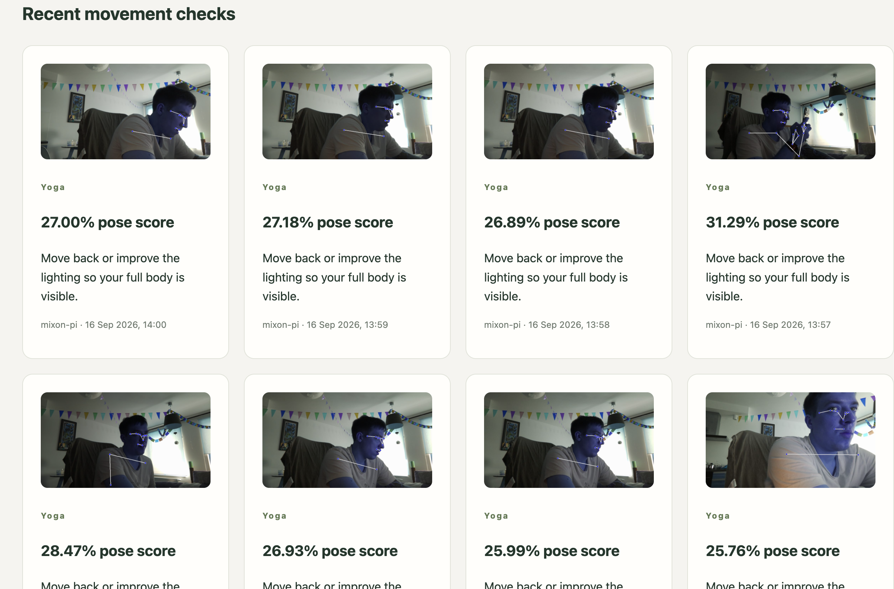
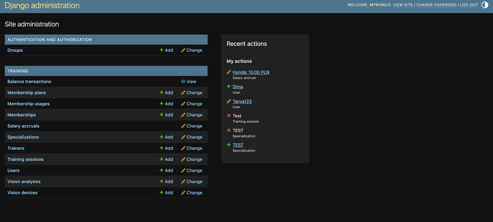

# TrainMate

**TrainMate** is a Django platform for a fitness community: clients discover and
book sessions, trainers manage their work and earnings, and administrators run
memberships, balances and payouts. It supports fitness, recovery, jiu-jitsu and
yoga — and includes an experimental **Vision Lab** powered by a Raspberry Pi 5
and Camera Module 3 Wide.

> *Find your rhythm. Move together.*

## Live demo

[Open TrainMate](https://trainmate-9390.onrender.com/accounts/login/?next=/)

Demo client:

- Login: `user`
- Password: `user12345`

## What it does

- **Session booking** — browse, search, create, confirm, cancel and complete
  training sessions with server-side capacity and duplicate-booking checks.
- **Weekly scheduling** — trainers create one-time sessions or regular weekly
  rules; active rules materialize bookable sessions only for the next three
  weeks, shown in a calendar view.
- **Roles and workspaces** — client, trainer and administrator permissions;
  trainers can manage only their own sessions and see their own earnings.
- **Memberships** — demo PLN balance, plans with a visit limit and validity
  period, automatic visit consumption and eligible cancellation refunds.
- **Operations** — clients, trainers, disciplines, balances and trainer salary
  accruals are managed through the app and Django Admin.
- **Vision Lab** — on-device pose landmarks from a Raspberry Pi camera, a
  private low-latency browser preview and a compact progress history.

## Product gallery

### Dashboard

The client landing page brings upcoming activity, community statistics and
navigation into one workspace.



### Training sessions

Clients can search scheduled sessions, while authorized users can create,
edit, delete and confirm them.



### Trainers and clients

The trainer directory supports discovery and profile management. The client
workspace gives staff an overview of fitness level, bookings and balance.

| Trainers | Clients |
| --- | --- |
|  |  |

### Memberships and payouts

Membership plans are purchased with a clearly labelled **demo balance** — no
real payment card or bank transaction is processed. Completed sessions produce
salary accruals that can be managed and marked as paid.

| Membership plans | Trainer payouts |
| --- | --- |
|  |  |

### Vision Lab — live pose tracking

A Raspberry Pi 5 runs pose detection locally with MediaPipe. The browser shows
an annotated camera preview with detected landmarks; the preview is temporary,
private to the device owner and is **not** a continuously stored recording.



For long-term progress, TrainMate saves one optional annotated frame, a pose
visibility score and feedback per minute — rather than saving every live frame.



### Django Admin

Django Admin provides a single operational surface for accounts, plans,
sessions, salary accruals, Vision devices and Vision analyses.



## Vision Lab architecture

```text
Camera Module 3 Wide
        |
        v
Raspberry Pi 5 + Picamera2
        |
        +-- MediaPipe pose landmarks and annotated JPEG frame
        |
        v
Django Vision API  --->  private owner dashboard
        |
        +-- live frame in short-lived server memory (about 5 fps)
        +-- optional persisted snapshot + score + feedback (once per minute)
```

The agent code and setup steps are in [raspberry_pi](raspberry_pi/). Register a
device on the Django host to generate its bearer token:

```bash
python manage.py create_vision_device --name mixon-pi --owner Mixon
```

Read [raspberry_pi/README.md](raspberry_pi/README.md) for Raspberry Pi
installation, local preview and LAN configuration. For deployment, use HTTPS or
a trusted private network/VPN and rotate device tokens regularly.

## Roles and access

| Role | Main permissions |
| --- | --- |
| **Client** | Browse and book sessions, manage their profile and membership, view their own Vision Lab data. |
| **Trainer** | Create, edit and delete only their own sessions; view their earnings. |
| **Administrator** | Manage users, trainers, disciplines, plans, balances, every session, payouts and Vision data. |

Create the first local administrator with:

```bash
python manage.py createsuperuser
```

## Tech stack

- **Backend:** Python, Django
- **Frontend:** Django templates, HTML, CSS
- **Vision:** Raspberry Pi 5, Camera Module 3 Wide, Picamera2, MediaPipe and OpenCV
- **Data:** Django ORM and local SQLite for development
- **Administration:** Django Admin

## Local setup

**Requirements:** Python 3.12+ for the web application.

```bash
git clone <your-repository-url>
cd trainmate
python3 -m venv venv
source venv/bin/activate
pip install -r requirements.txt
python manage.py migrate
python manage.py seed_demo
python manage.py createsuperuser
python manage.py runserver
```

Open [http://127.0.0.1:8000/](http://127.0.0.1:8000/). During local
development, Django's console email backend prints activation and password reset
links to the terminal.

## Deploy with Neon and Render

TrainMate is prepared to run the Django web service on **Render** and store its
production data in **Neon PostgreSQL**. The `render.yaml` Blueprint defines the
web service; it deliberately does not contain database credentials.

1. Create a Neon PostgreSQL project and copy a fresh pooled connection string.
2. Push this repository to GitHub, including `render.yaml` and `build.sh`.
3. In Render, choose **New → Blueprint** and connect the repository.
4. When Render prompts for secrets, enter the Neon URL as `DATABASE_URL` and
   choose a password for `DEMO_PASSWORD`, and set `ADMIN_USERNAME` plus a unique
   `ADMIN_PASSWORD` for the first Django administrator. Render generates
   `SECRET_KEY` itself.
5. After the deploy finishes, visit the supplied `.onrender.com` URL. The build
   creates a low-privilege demonstration client with username `user` and the
   password configured in `DEMO_PASSWORD`, plus the administrator configured
   through `ADMIN_USERNAME` and `ADMIN_PASSWORD`.

Never commit `.env` or a Neon connection string. Locally, place the connection
string in `.env` as `DATABASE_URL=postgresql://...`; Django reads it through
`python-dotenv` while operating-system environment variables still take
precedence.

## Security and production notes

- Accounts require email activation; password reset uses Django's time-limited
  token flow.
- Login and password-reset endpoints are rate-limited.
- Booking, cancellation and session completion use POST requests with CSRF
  protection.
- Vision devices authenticate with a bearer token and results are restricted to
  the device owner and administrators.

Copy [.env.example](.env.example) to the deployment environment and configure a
private `SECRET_KEY`, `DEBUG=0`, allowed hosts and SMTP credentials. For a
multi-server deployment, use a shared cache such as Redis for rate limits and
live frames.

Render's free web-service filesystem is temporary. The live Vision Lab frame is
already temporary by design, but persisted progress snapshots need external
object storage (for example, S3 or Cloudinary) before relying on them in a
long-lived public deployment.

```bash
python manage.py test
python manage.py check
DEBUG=0 SECRET_KEY="a-long-unique-secret" ALLOWED_HOSTS="example.com" python manage.py check --deploy
```

## Database diagram

The editable [draw.io database diagram](docs/database-diagram.drawio) covers
users, trainer profiles, sessions, memberships, balance transactions, salary
accruals and Raspberry Pi vision results. Open it with
[diagrams.net](https://app.diagrams.net/) to edit it.

## Scope and next steps

TrainMate is an educational portfolio project. Vision Lab currently measures
pose visibility and records a privacy-conscious history; exercise-specific
form rules (for example, squat depth or biceps-curl repetitions) are a planned
next step. Real payments, CI/CD, Docker deployment, centralised logging and
automated database backups are intentionally outside the current scope.
